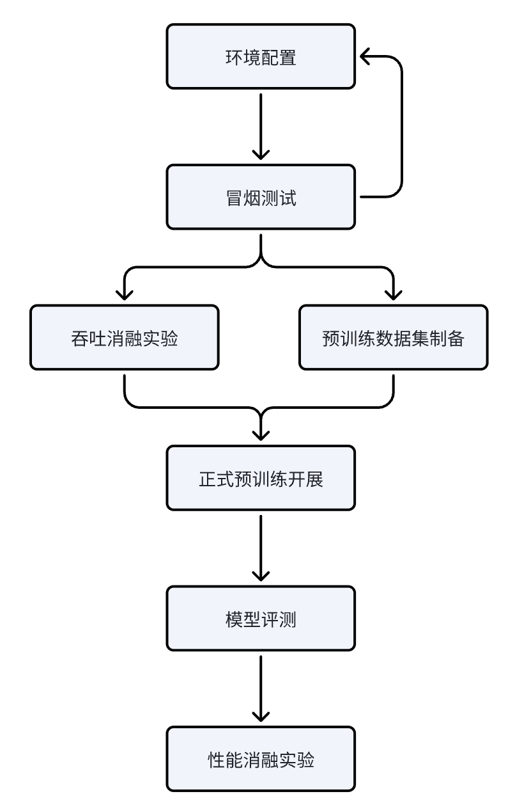

# 实验一：小型LLM预训练与评估

## 实验目标与项目介绍

本实验旨在帮助学生掌握大语言模型（LLM）预训练的基本技术和流程。通过本实验，学生将学习基于 Megatrom-LM/MindSpeed-LLM 框架与生态的一系列大模型训练技术，掌握相关技能，包括预训练数据集预处理，模型预训练任务执行，训练效能分析，和预训练后的模型评估。实验内容涵盖了数据处理、模型配置、训练优化等关键环节，旨在提升学生对LLM预训练技术的理解和实践能力。

本项目的实验代码在 [MindSpeed-LLM](https://gitee.com/ascend/MindSpeed-LLM) 上改造而成，针对本次实践的需求优化了实验脚本（特别是`MindSpeed-LLM/scripts`中的内容）和部分代码。

**分组实验安排：4人一组，2人先做效率ablation实验（讨论合作进行，一次只跑一个进程），另外2人同步做数据采样和预处理（讨论合作进行，一次只跑一个进程）。**

## 实验依赖与环境配置

### 1. 软硬件基础环境
本项目的基本依赖情况如下表所示：

| 加速卡型号 | 驱动和CANN版本 | Python版本 | 主要Python包依赖 |
|------------|----------------|------------|------------------|
| 昇腾910B   | Ascend HDK 23.0.6，CANN 8.0.RC3 | Python 3.10  | torch 2.5.1，torch-npu 2.5.1.post1，transformers 4.43.2 等 |

所需要的环境，我们已经在服务器上为大家配置好了直接可用的容器`ep1_lab`，可以直接使用。
<!-- 请参考`docs/environment.md`文件配置本次实验所需的环境。 -->

### 2. 文件资源

本实验所需的文件资源已放置在相应的路径。说明如下：

- `/data2/MindSpeed-LLM/`: 实验项目代码，与本仓库中的`ep1/MindSpeed-LLM`目录一致（所以无需再手动clone项目）。本项目将以该目录作为工作根目录。
- `/data2/datasets/Ultra-FineWeb-ShaoZW_subset`: 预训练基础语料，我们的实验将从中采样一份 50GB 的子集作为预训练数据集。
- `/data2/datasets/smoke_test`: 预处理好的小数据集，用于冒烟测试和效率实验。
- `/data2/datasets/eval/mmlu_subset`: MMLU 评估数据集的一个子集。
- `/data2/datasets/eval/cmmlu_subset`: CMMLU 评估数据集的一个子集。

## 基础操作指南

### 1. 进入容器

登陆服务器后，执行以下命令进入容器：

```bash
docker exec -it ep1_lab /bin/bash
```

上述命令会开启一个容器内的命令行窗口，可以在其中执行任意bash命令。注意，容器中的`/data/`、`/data1/`、`/data2/`、`/data3/`与宿主服务器上的该路径为同一文件夹（共享存储）。然后可以进入本实验的工作根目录：

```bash
cd /data2/MindSpeed-LLM
```

退出容器：先按`Ctrl+P`，再按`Ctrl+Q`。退出后，容器依然处于运行状态，但是无法重连刚才的命令行对话，重新执行`docker exec -it ep1_lab /bin/bash`命令只会开启一个新的命令行窗口。这对耗时任务存在问题，例如，训练模型时，往往需要持续观察输入输出；如果网络掉线，我们就会丢失当前的对话，甚至可能导致训练中断。为此，我们需要熟悉screen工具的使用，以保证可靠的后台运行，以及在重连容器后仍能继续观察输入输出。

### 2. screen工具的使用

screen工具用于创建可分离的终端会话，确保实验过程中即使网络连接中断（或docker对话退出），实验任务仍能继续运行。可以通过以下命令创建一个新的screen会话：

```bash
screen -S session_name
```

在创建的screen会话中，可以使用`Ctrl+A`接`D`键来退出screen会话，会话中的进程将继续运行。要重新连接到之前的screen会话，可以使用以下命令：

```bash
screen -rD session_name
```

可以开启多个screen会话，使用以下命令查看当前所有的screen会话：

```bash
screen -ls
```


## 实验设计与指导

*注：下述说明均以 `/data2/MindSpeed-LLM/` 作为工作根目录。*

### 1. 实验设定与流程

我们对小型LLM的从头预训练任务进行了如下设定：
- 模型设定：采用类似llama2的模型架构，参数量在500M左右（<530M），具体架构配置见`scripts/pretrain_model.sh`，示例脚本将模型均命名为`zen-500m`，你也可以取自己喜欢的名字。
- Tokenizer：使用`assets/zen_tokenizer`，是项目组预先基于`Ultra-FineWeb-ShaoZW_subset`数据集训练得到的SentencePiece tokenizer。
- 预训练数据集：基于`Ultra-FineWeb-ShaoZW_subset`数据集，使用`scripts/pt_data_sample.sh`脚本采样存储规模为50GB的预训练数据集，可自行调整采样策略（详见[数据集准备](#数据集准备)部分）。
- 评估数据集：使用`/data2/datasets/eval/mmlu_subset`和`/data2/datasets/eval/cmmlu_subset`两个数据集进行模型评估。
- 研究性任务：针对预训练过程中的*训练吞吐效率（必选）*和*模型性能（可选，作为加分项）*两个维度，进行消融实验和分析，具体实验设计见[消融实验](#消融实验)部分。效率ablation实验在`/data2/datasets/smoke_test`中进行，只需要修改`scripts/pretrain_model.sh`中的数据集路径，可立即使用。

<!-- 请参考下图工作流合理分配小组工作，安排实验进度：

 -->

### 2. 数据集准备

数据集准备分为两个步骤：**数据采样**和**数据预处理**。

#### 2.1 数据采样

使用 `scripts/pt_data_sample.sh` 脚本从源数据集中采样生成预训练子集：

```bash
bash scripts/pt_data_sample.sh
```

该脚本调用 `scripts/data_sample_tool.py`，默认参数设置如下：
- **输出目录**：`/data2/datasets/pretrain_subset_50GB`
- **目标大小**：50GB
- **中英文比例**：中文 20%，英文 80%
- **最低分数过滤**：中英文均为 0.5
- **分片大小**：每个 parquet 文件约 500MB

你可以根据研究需要调整 `pt_data_sample.sh` 中的参数，例如调整中英文比例：

```bash
python scripts/data_sample_tool.py \
    --input-root /data2/datasets/Ultra-FineWeb-ShaoZW_subset/ \
    --out-dir /data2/datasets/pretrain_subset_50GB \
    --train-size-gb 50 \
    --zh-ratio 0.5 \    # 中文占比调整为 50%
    --en-ratio 0.5 \    # 英文占比调整为 50%
    --min-score-zh 0.5 \
    --min-score-en 0.5 \
    --target-shard-mb 500
```

#### 2.2 数据预处理

完成数据采样后，使用 `scripts/preprocess_pt_data.sh` 脚本将数据转换为训练所需的 mmap 格式：

```bash
bash scripts/preprocess_pt_data.sh
```

该脚本会将采样后的数据进行 tokenize 并转换为 mmap 格式，输出到 `/data2/datasets/pretrain_preprocessed/` 目录。主要参数说明：
- **DATA_ROOT**：输入数据目录（默认为采样后的数据集路径）
- **TOKENIZER_DIR**：tokenizer 目录（默认为 `assets/zen_tokenizer`）
- **OUTPUT_ROOT**：输出目录

预处理完成后，会在输出目录下生成 `train/` 和 `val/` 两个子目录，分别包含训练集和验证集的 mmap 数据文件。

### 3. 模型预训练

使用 `scripts/pretrain_model.sh` 脚本启动预训练任务：

```bash
bash scripts/pretrain_model.sh
```

#### 3.1 模型架构配置

脚本中定义的 500M 模型架构如下：

| 参数 | 值 | 说明 |
|------|-----|------|
| num-layers | 24 | Transformer 层数 |
| hidden-size | 896 | 隐藏层维度 |
| num-attention-heads | 16 | 注意力头数 |
| ffn-hidden-size | 4864 | FFN 隐藏层维度 |
| seq-length | 4096 | 序列长度 |
| position-embedding-type | rope | 位置编码方式 |
| normalization | RMSNorm | 归一化方式 |

#### 3.2 训练配置

主要训练参数：

| 参数 | 默认值 | 说明 |
|------|--------|------|
| TRAIN_ITERS | 20000 | 训练步数 |
| TOKENS_PER_STEP | 524288 | 每步训练的 token 数 |
| BATCH_LENGTH | 4096 | 单条样本长度 |
| lr | 3e-4 | 学习率 |
| lr-decay-style | cosine | 学习率衰减策略 |
| lr-warmup-fraction | 0.01 | warmup 占比 |

#### 3.3 并行设置

默认使用 8 卡数据并行（DP=8），你可以调整以下参数进行不同的并行策略实验：

| 参数 | 默认值 | 说明 |
|------|--------|------|
| TP | 8 | 张量并行度 |
| PP | 1 | 流水线并行度 |
| CP | 1 | 上下文并行度 |
| GPUS_PER_NODE | 8 | 每节点使用的 GPU 数 |

#### 3.4 输出与日志

- **检查点目录**：`outputs/zen_500m_20k/`（以训练步数命名）
- **日志文件**：`logs/zen_500m_20k_<timestamp>.log`

训练过程中会每 1000 步进行一次验证，每 10000 步保存一次检查点。

#### 3.5 断点续训

如果训练中断或需要从某个检查点继续训练，使用 `scripts/pretrain_model_resume.sh` 脚本：

```bash
bash scripts/pretrain_model_resume.sh
```

需要修改脚本中的以下参数：
- **CKPT_DIR**：检查点所在目录
- **CKPT_LOAD_ITER**：要加载的检查点步数

### 4. 模型评估

使用 `scripts/run_eval.sh` 脚本在 MMLU 数据集上评估模型：

```bash
bash scripts/run_eval.sh /path/to/checkpoint_dir
```

例如，评估权重文件夹`outputs/zen_500m_20k`中的模型，具体是哪一个checkpoint由文件夹下的`latest_checkpointed_iteration.txt`文件决定：

```bash
bash scripts/run_eval.sh outputs/zen_500m_20k
```

#### 4.1 评估配置

评估脚本使用与训练相同的模型架构配置，主要评估参数：
- **评估数据集**：MMLU 子集（位于 `/data2/datasets/eval/mmlu_subset/test`）
- **评估语言**：英文
- **max-new-tokens**：64

#### 4.2 评估输出

评估结果会保存在 `logs/eval_<timestamp>/mmlu_subset.log` 中，包含各科目的准确率和总体准确率。

### 5. 消融实验

#### 5.1 训练吞吐效率消融实验

选择一个或多个因子进行调研。可选的实验因子包括：

1. **Batch Size 配置**：调整 `BATCH_SIZE_PER_DEVICE` 或 `TOKENS_PER_STEP`
2. **并行策略**：调整 TP、PP、CP 任一参数

吞吐效率的指标计算方式为：`TOKENS_PER_STEP / (sec_per_step)`。其中，`TOKENS_PER_STEP`为训练配置中的参数，`sec_per_step`为训练输出/日志中的`elapsed time per iteration (ms)`字段，其单位为毫秒，需要转换为秒。

#### 5.2 模型性能消融实验（选做，加分项）

可选的实验因子包括：

1. **学习率**：调整 `--lr` 参数
2. **训练步数**：调整 `TRAIN_ITERS` 参数
3. **模型架构**：调整模型架构配置
4. **上下文长度**：调整 `BATCH_LENGTH` 参数
5. 其他

以训练最终的val loss作为模型性能的主要指标，以`mmlu_subset`和`cmmlu_subset`数据集的准确率作为辅助指标。

#### 5.3 实验建议流程

1. **确定实验变量**：选择 1 个因子作为实验变量
2. **设计对照组**：保持其他参数不变，仅调整实验变量
3. **执行训练**：记录不同配置下的训练日志
4. **分析结果**：使用提供的可视化工具分析结果
5. 若要研究多个变量，则按上述流程分别进行实验，并进行结果对比。

### 6. 结果可视化

项目提供了两个可视化工具用于分析训练结果：

**绘制训练曲线**：

```bash
python scripts/plot_training_curves.py logs/exp1.log logs/exp2.log \
    --output outputs/comparison.png \
    --smooth-window 50 \
    --title "Experiment Comparison"
```

**绘制 exp(loss) 曲线**（适用于对比后期收敛情况）：

```bash
python scripts/plot_exp_loss_after_tokens.py logs/exp1.log logs/exp2.log \
    --output outputs/exp_loss_comparison.png \
    --token-threshold 5e9 \
    --smooth-window 50
```

这些工具会自动从日志中解析 loss 值，并将横轴转换为 token 数，便于进行细致对比。

## 实践作业提交内容

- 项目输出的预训练log文件和评估log文件
- 实验报告，内容包括但不限于实验经过记录、预训练与评估结果分析、消融实验结果与分析等
